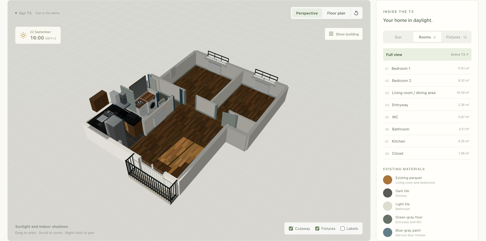
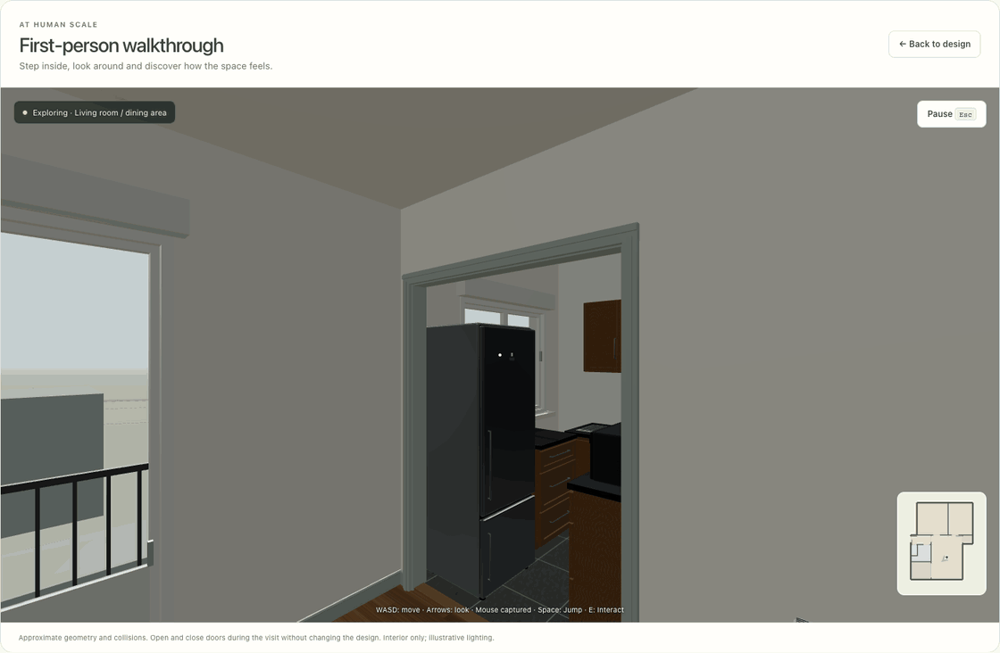
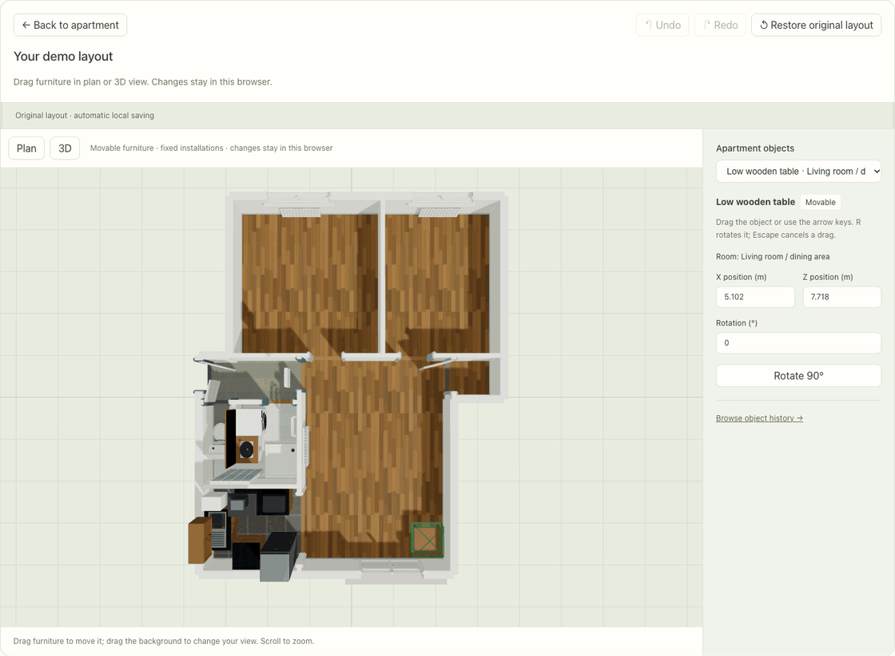
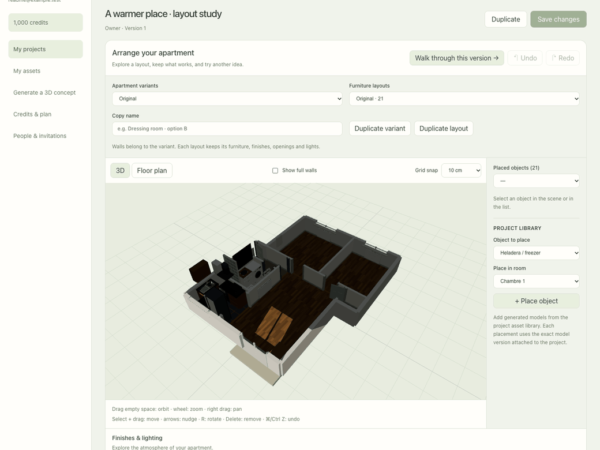
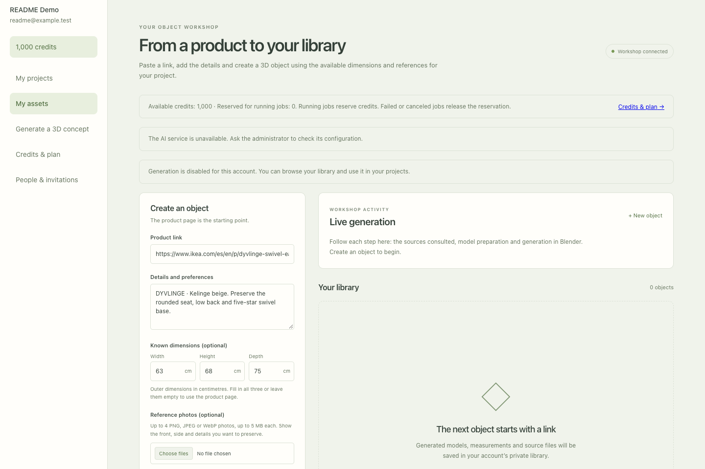
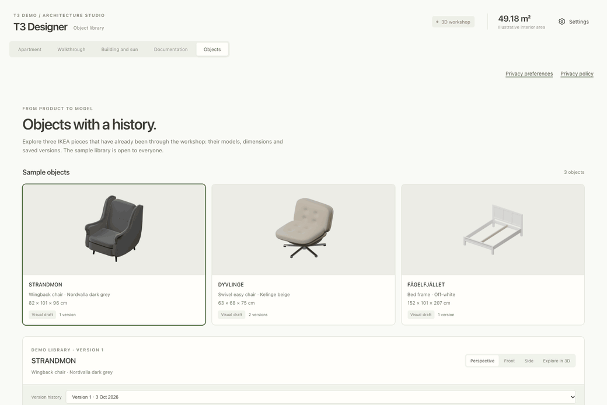
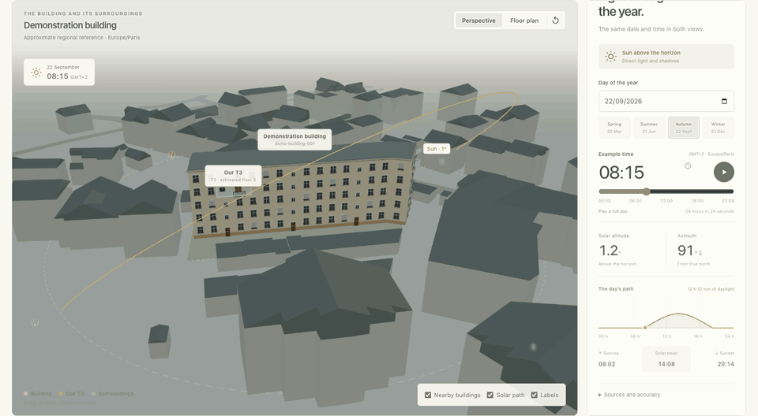
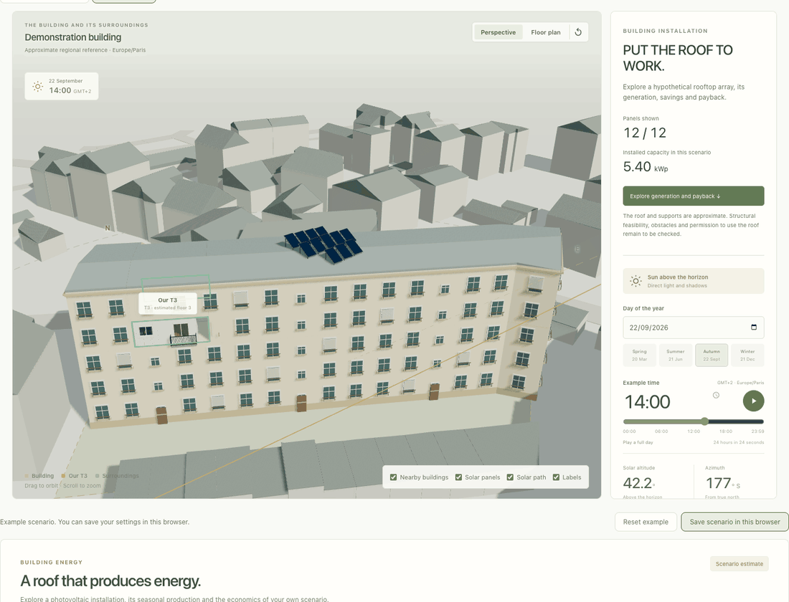
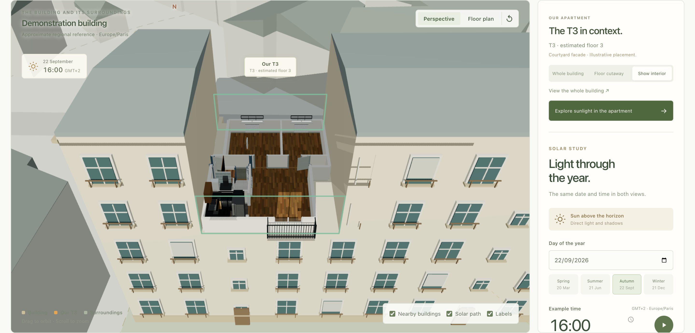
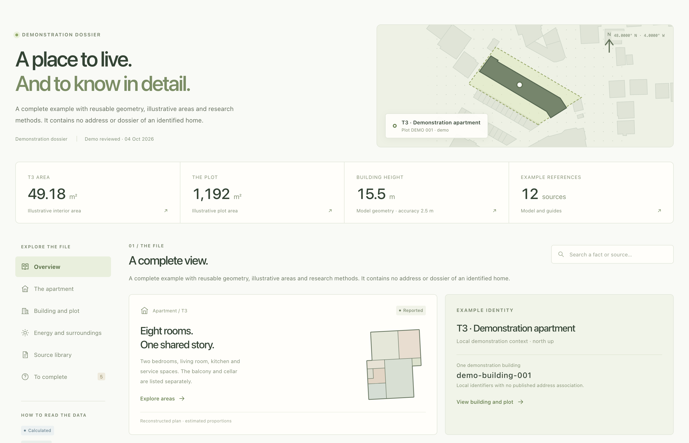

# T3 Designer

**Walk through it. Make it yours. Follow the light.**

A 3D workspace for exploring a home and trying out what it could become.
Walk from room to room, rearrange furniture, compare finishes and lighting,
and turn a product link into an editable 3D draft. Keep the surrounding building,
the sunlight and the evidence behind the reconstruction in the same workspace.

Explore a complete two-bedroom demo apartment with **React, Three.js and Blender**.
The optional backend adds private projects and an **OpenAI-powered object workshop**.

[Take a tour](#take-a-tour) · [Run locally](#quick-start) · [Documentation](docs/README.md)



## Take a tour

### Step inside

Switch from the cutaway to **Walkthrough** and explore at eye level. Walk around
furniture, look through windows and open a nearby door with **E**. Doors block
your path when closed; open them and continue into the next room. Change the
sun's time or your eye height to see the same space differently.



**W/A/S/D** to move · **Mouse or arrow keys** to look · **E** for doors ·
**Shift** to run · **C** to crouch · **Space** to jump · **Esc** to pause.
Touch and on-screen controls are available too.
[Walkthrough controls and limits →](docs/workflows/walkthrough.md)

### Try another arrangement

Open **Apartment → Rearrange furniture**. Select the fridge, microwave or low
table, drag it in the floor plan or 3D view, then rotate or nudge it into place.
Undo, redo and **Restore original layout** make it easy to experiment. Fixed
installations stay locked.



The demo remembers your layout **in this browser**, and the walkthrough uses
that arrangement. No account is needed. Placement remains approximate; it does
not certify clearances or detect every collision.
[Public demo guide →](docs/workflows/public-demo.md)

### Design a version of your own

With the optional backend enabled, **My projects** gives you a private copy of the scene. Keep named apartment
variants for different dividers, and separate furniture layouts for each one.
Try wall colors, floor materials, door and window styles, curtains, blinds and
shutters. Add room lights or an emitter to a lamp, then compare brightness and
warm or cool light.



[Open the saved design as a still image →](docs/media/private-project.png)

- **Arrange precisely.** Drag with optional grid snapping, enter positions,
  rotate, duplicate or remove instances, and place objects from your library.
- **Keep alternatives.** Duplicate a layout for another furniture or finish
  scheme; duplicate a variant for a different partition arrangement.
- **Visit the draft.** Choose **Walk through this version** to explore the
  selected design, including unsaved edits, then return to the editor.
- **Save deliberately.** **Save changes** stores the project. Stale saves are
  blocked so another edit cannot be silently overwritten. Share a project
  with an invited member as a viewer or editor.

Private projects use explicit server saves; the public furniture demo uses
browser storage. [Apartment editor →](docs/workflows/apartment-editor.md) ·
[Accounts, sharing and recovery →](docs/workflows/private-projects.md)

### From a product link to an object with a history

Paste a product URL in the private **Objects** workshop. Add a description,
reference photos or measurements when useful. OpenAI researches the source and
produces a structured recipe; Blender builds the geometry, renders it and
exports the model. The activity feed records research, modelling and review
milestones as the job progresses.



*The capture shows a prepared request. Generation runs separately and needs an
authenticated account, available credits and generation enabled on the backend.*

The workflow keeps the evidence beside the result:

1. **Research.** Collect product references and outer dimensions; ask for
   missing photos or measurements instead of inventing them.
2. **Build and compare.** Render perspective, front and side views, then compare
   them with the reference photos. Up to three review/correction rounds run
   per attempt.
3. **Refine.** Describe a mismatch with **Create improved version**. Reopen
   earlier versions without overwriting their files or recorded findings.
4. **Use it.** Download the **GLB**, editable **`.blend`** source and manifest,
   or add the selected version to a private project's library and place it.

The public **Objects** gallery lets everyone explore the archived STRANDMON,
DYVLINGE and FÅGELFJÄLLET examples: orbit the 3D models, switch render views,
compare saved versions and download their GLBs.



These are independent approximations, not official manufacturer models.
Dimensions are checked, but shape and materials still need visual review;
DYVLINGE's outstanding corrections remain visible. The generator supports a
reviewed chair recipe, simple tables and bounded geometric furniture drafts.
[Local workshop setup, activity and limitations →](docs/workflows/local-asset-workshop.md)

### Watch a day unfold

Scrub the timeline or press play to follow sunlight through the apartment and
across neighbouring buildings. Compare seasons, focus on a room, or switch to
the building view without losing the selected moment. The sun path, altitude
chart and sunrise/sunset times follow the same study.



*The GIF samples the real time controls at an accelerated pace. Solar time uses
the demo's `Europe/Paris` timezone, including daylight-saving changes; nighttime
has no direct sunlight.*

### Explore what a solar roof could produce

Run the current source locally and open **Building and sun → Solar energy**
to try a hypothetical rooftop installation.
Change the number of panels, orientation, tilt and losses, then explore daily
and monthly generation, on-site consumption, costs and investment payback.
The roof preview and production calculation use the panels that actually fit.



Save the scenario explicitly in your demo browser or with a private project.
Climate factors and financial inputs remain visible and editable. This is a
scenario study, not an installation plan or guaranteed return; the energy
calculation does not measure the shadows shown in the 3D scene.
[Photovoltaic method and limits →](docs/model/photovoltaic-model.md)

### Follow the evidence, from room to neighbourhood

Inspect rooms, dimensions, fixtures and individual GLBs. Reveal the apartment
inside its building, then explore the surrounding volumes. Open
**Documentation** to search the example dossier, modeled areas,
observations, methodology links and unresolved questions.

| Building and sun | Property dossier |
| --- | --- |
|  |  |
| Understand where the apartment sits. | Explore modeled examples and their limitations. |

The interface is available in **English, Spanish and French**, with **light,
dark and system themes**. Language and appearance are saved in your browser.
All media above comes from the application; [the capture workflow](docs/workflows/readme-media.md)
explains how to reproduce it.

## Quick start

Use **Node.js 24+**, **pnpm 12.7.0** (the repository pin), and a browser with
**WebGL 2** enabled.

```sh
pnpm install
pnpm dev
```

Open [127.0.0.1:5173](http://127.0.0.1:5173). This starts the complete public
demo: no account, API key, backend or Blender installation is needed. Furniture
layouts and saved energy scenarios stay in this browser. Solar studies calculate
locally; the bundled apartment, object models and previews are included.

For static hosting, run `pnpm build:demo` and publish `apps/web/dist` with SPA
fallback. The default bundle excludes the private application. See the
[portable deployment guide](docs/deployment.md) for Docker and hosting details.

| Try it | Where | Persistence |
| --- | --- | --- |
| Apartment, walkthrough, furniture, object gallery, daylight and dossier | Public demo | Furniture layout stays in your browser |
| Rooftop energy scenarios | Local demo or private project | Explicit browser or project save |
| Variants, finishes, lights, private objects and project sharing | **My projects**, with an invited account | Explicit server save |
| Research, generate and revise new objects | Local **Objects** workshop, with generation enabled | Local job history and asset files |

### Optional local backend

Docker includes the API, PostgreSQL and Blender. Generate local secrets once,
then start the stack and create your administrator:

```sh
pnpm local:setup
pnpm local:up
pnpm local:account bootstrap you@example.com
```

Open [127.0.0.1:8080](http://127.0.0.1:8080). The account command writes a single-use
activation link; the [local backend guide](docs/local-backend.md) explains how to
read it, set your password, preserve your data and use the native development
alternative. Only the web port is exposed, on loopback. Generation and payments
start disabled; provide your own API key only if you enable generation.

Use `pnpm dev:full` for the native web + API development workflow after following
the account setup in that guide. Uploaded/generated files use a persistent local
volume. MinIO/S3 storage is not integrated into this stack.

### Accounts, credits and generation

Administrators and gifted premium members can create invitation links. Standard
accounts start with **100 credits for 15 days**; gifted premium accounts receive
**1,000 credits each calendar month**. Manual projects, editing and viewing remain
free. The account screen shows the balance, reservations and transaction history.

Generation uses a server-side OpenAI API key and reserves credits before work
starts. Object drafts cost 20 credits and revisions 10. **Generate with AI** creates
an editable conceptual project or apartment for 50 credits, or a building for 100.
Enter the footprint, height and location: the result models one interior floor
and an approximate building envelope. It is not a measured reconstruction.

Install Blender, configure `OPENAI_API_KEY` privately and set
`T3_GENERATION_ENABLED=true` to run generation locally. The
[workshop guide](docs/workflows/local-asset-workshop.md) also documents the optional
local Codex adapter. Public generation requires the hosted API adapter.

Subscriptions and top-ups have a configurable ARS catalog and a **development-only
Mercado Pago integration**. Payments are disabled until test credentials are
configured; publishing the app does not enable real charges.
[Credits, invitation privileges and payment states →](docs/credits-billing.md)

## How it works

**Editable scene data, interactive exploration and reproducible assets.**
React and Three.js render the apartment in the browser. Projects store their
variants, layouts and customization alongside a validated scene snapshot.
Individual GLBs stay reusable; the apartment is not one opaque mesh.

The object workshop follows this pipeline:

```text
Product URL + references → OpenAI research → validated geometry recipe
    → Blender build + renders → photo/render review → versioned asset library
                                     ↳ corrections ↗
```

Blender also assembles the apartment and building from exported JSON snapshots
for offline renders. Both renderers share geometry, placement and solar inputs;
materials have separate implementations. **The offline assembler does not yet
render the editor's new finish/light overrides or photovoltaic installations.**

| Where | What it owns |
| --- | --- |
| [`apps/web`](apps/web) | React UI, Three.js scenes, editor, walkthrough and translations |
| [`apps/api`](apps/api) | Accounts, credits, invitations, OpenAI jobs, Blender worker and downloads |
| [`apps/web/src/data`](apps/web/src/data) | Canonical apartment, fixtures, building context and dossier |
| [`apps/web/src/lib/solar.ts`](apps/web/src/lib/solar.ts) | Sun geometry and civil-time conversion |
| [`apps/web/src/energy`](apps/web/src/energy) | Rooftop layout, generation and financial scenarios |
| [`packages/scene-schema`](packages/scene-schema) | Validated scene, project and customization contracts |
| [`packages/asset-schema`](packages/asset-schema) | Product requests, recipes and asset-library contracts |
| [`packages/geometry`](packages/geometry) | Renderer-independent geometry helpers |
| [`scripts/blender`](scripts/blender) | Asset generation, auditing, scene assembly and rendering |

Geometry uses metres. See the [architecture guide](docs/architecture/architecture.md)
for data ownership, coordinates and extension boundaries.

## Development

The complete code and data check also requires **Python 3.10+**:

```sh
pnpm check
```

This runs lint, TypeScript checks, Node and Python tests, read-only snapshot
verification and the production build. It does not require Blender or MCP.

| Command | Purpose |
| --- | --- |
| `pnpm dev` / `pnpm demo` | Start the standalone public demo |
| `pnpm dev:full` | Start the native web + API development workflow |
| `pnpm local:up` | Start the optional Docker backend stack |
| `pnpm build:demo` / `pnpm build:full` | Build the static demo / frontend with backend features |
| `pnpm test` | Run package, script and Python tests |
| `pnpm scene:verify` | Check tracked snapshots without writing |
| `pnpm test:e2e:fast` | Browser flows excluding `@webgl`, with one worker |
| `pnpm test:e2e:webgl` | WebGL rendering and input checks, with one worker |
| `pnpm test:e2e` | All main Playwright browser tests |
| `pnpm test:analytics` | Analytics and consent browser checks |
| `pnpm test:accounts` | Real account/project browser flow |
| `pnpm test:demo` | Production demo without backend or external requests |
| `pnpm audit:public` | Scan source and binary metadata for private references |
| `pnpm audit:history` | Check every ancestor of the current revision before publishing |
| `pnpm check:all` | Quality, browser, analytics and account checks |

Install the browser once with
`pnpm --filter @t3-designer/web exec playwright install chromium`.
Browser release checks run locally; some WebGL checks use SwiftShader, so a
passing test is not proof of hardware-GPU behaviour. Inspect rendered captures
and verify the deployed UI as described in the
[release workflow](docs/deployment.md).

### Render with Blender

```sh
pnpm scene:snapshot    # Refresh the tracked JSON snapshots
pnpm blender:render    # Assemble and render with Cycles CPU
```

The default snapshot uses **2026-09-26 at 15:00, Europe/Paris**, independently of
the browser's selected time. Generated scenes, reports and images go under the
ignored `artifacts/` directory. Set `BLENDER_BIN` if needed.
[Blender setup, custom dates and render options →](docs/workflows/blender.md)

## About the reconstruction

This is a generalized demonstration scene derived from an authored apartment model. **Dimensions and building
placement are approximate.** The example room areas sum to **49.18 m²**; the
model is not a measured net-area survey.

The context contains **99 building footprints**, approximate heights,
roads and an example parcel. Geographic identifiers and labels are generalized;
the preserved geometry remains illustrative and is not anonymized survey data. Orientation, facade openings, roof forms and
some fixture dimensions are inferred. The bathroom still needs measurements;
the basement is not reconstructed. Ground is flat, with terrain, distant
obstructions and vegetation outside the current scene.

Sunlight, artificial lighting and energy results are exploratory studies.
They are not certified insolation, photometric or engineering reports.
The dossier distinguishes modeled examples, observations and missing evidence.
It is not a property record, diagnostic certificate or legal-lot confirmation.

[Apartment geometry](docs/model/apartment-geometry.md) ·
[Building placement](docs/model/apartment-placement.md) ·
[Solar model](docs/model/solar-model.md) ·
[Source provenance](docs/reference/evidence.md)

## Documentation and privacy

The [documentation index](docs/README.md) collects the architecture, research,
workflows and checkpoints. Other useful starting points:

- [Building research and data attribution](docs/research/building-research.md)
- [Property dossier scope and sources](docs/research/property-dossier.md)
- [Internationalization](docs/architecture/i18n.md)
- [Analytics and privacy](docs/analytics.md)
- [Public code and private installations](docs/public-private-boundary.md)

The app includes a neutral `/privacy` notice. Analytics is disabled by default.
Operators can provide a public runtime `site-config.json` describing their own
identity, contact, hosting and retention policy; optional analytics additionally
requires valid settings, a matching hostname and visitor consent. The privacy
page itself is never measured. See [site configuration](docs/site-configuration.md).
Infrastructure addresses, deployment jobs and operator records belong in a
separate private repository; credentials belong in secret storage.

## License and attribution

Original code, documentation, authored 3D geometry and generated textures are
available under the [MIT License](LICENSE). Copyright © 2026 Pablo Coronel.
Forks, modifications and commercial use are welcome; retain the required
copyright and license notices.

If you build on this work, credit **T3 Designer by Pablo Coronel (pablitxn)** and
link to the original repository. This is appreciated, not an additional license
condition.

Third-party dependencies, public datasets and externally supplied reference
material retain their own licenses and rights. Preserve the source attribution
and retrieval dates in the [building research](docs/research/building-research.md)
and [reference evidence](docs/reference/evidence.md).
