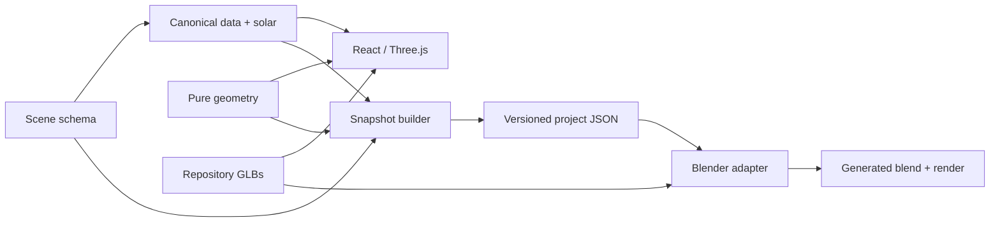

# Architecture and extension guide

The project has two rendering adapters over one metric apartment model. The web
offers interactive inspection; Blender consumes a versioned scene snapshot for
offline rendering. Neither an open Blender window nor a live MCP connection is
required to recover the current model.

## Ownership and dependency direction

| Location | Responsibility |
| --- | --- |
| `packages/scene-schema/src/apartment.ts` | Domain types and validation: rooms, walls, openings, assets and fixtures. |
| `packages/scene-schema/src/project.ts` | Versioned export contract, placement, world geometry, solar instants and cross-reference validation. |
| `packages/geometry` | Pure polygon, bounds and wall-solid calculations; no React, Three.js or Blender dependencies. |
| `apps/web/src/data` | Canonical T3 reconstruction, geographic extract, fixture catalog and estimated apartment registration. |
| `apps/web/src/lib/solar.ts` | Pure astronomy and Paris civil-time conversion, independent of the renderer. |
| `apps/web/src/lib/useSolarStudy.ts`, `useApartmentView.ts` | Interaction state and actions. Shared solar/selection state lives above the workspace switch. |
| `apps/web/src/components/*Explorer.tsx`, `SolarControls.tsx` | Inspector, navigation and controls; no astronomical equations or geometric source data. |
| `apps/web/src/components/*Scene.tsx`, `Apartment.tsx`, `BuildingContext.tsx` | Three.js geometry, materials, lights, cameras and presentation cuts. |
| `scripts/lib/project-snapshot.ts` | Pure assembly of the domain data into the validated export. |
| `scripts/export_scene.ts` | Filesystem/CLI boundary: export, missing-asset checks and read-only drift verification. |
| `scripts/blender/assemble_project.py` | Blender adapter for the combined apartment, context and exact selected sun. |
| `scripts/blender/validate_assets.py` | Read-only integrity audit of persisted GLBs and editable Blender reference files. |

Project-specific data stays in the existing web data directory for now. The
exporter imports only these pure modules, never React or the renderer. Extracting
a dedicated project-data package becomes useful when a second application needs
to edit this data; a directory move alone would not improve today's contract.

## Coordinate and visibility contracts

All geometry uses metres. The apartment has local plan X/Z with Y up; the site
uses X east, Y up, Z south. `apartment-placement.ts` supplies the rigid transform.
Blender maps a site point to `(x, -z, y)`. Solar directions undergo rotation only,
never translation. Estimated dimensions and placement remain marked as estimates.

`segmentWall` owns aperture segmentation. The export contains those same
solids, so Blender does not independently reconstruct doorway/window holes.
Floor/ceiling polygons and building sections are exported alongside them. The
through-building slot, physical ceiling and complete wall solids are essential
to interior solar shadows.

A camera cut is a presentation choice. Full physical obstructions must continue
to cast shadows even when invisible to the camera. The web's `ShadowOnly` helper
clones and restores materials without changing shared visible materials; Blender
uses Cycles ray visibility. Hiding the surrounding context must retain its shadows.
Both scenes render on demand in the web; camera transitions and late-loading
labels/environments explicitly invalidate the canvas.

## Persisted scene and assets

`assets/scenes/t3-project.json` has `schemaVersion: 1` and includes the apartment,
fixture references with repository-relative asset paths, placement, physical
wall/slab sections, geodata, exact selected UTC instant and a full daily solar
sample set. Default exports use a fixed reference date/time so changes are
reviewable. The selected instant is exact to the requested minute; `defaultFrame`
only identifies the nearest 15-minute sample. Clock-change days have 92 or 100
samples, preserving the actual 23 or 25 hours.

The `.blend` files under `assets/blender` preserve authored/reference work. GLBs
under `apps/web/public/models` are versioned inputs used by both renderers. The
current generated combined `.blend`, PNGs and detailed validation reports belong
under ignored `artifacts/`; rebuilding them does not rewrite historical models.
The combined `.blend` embeds the input snapshot and packs image resources.

Run `pnpm scene:snapshot` after canonical data changes, then `pnpm scene:verify`.
For an alternate date use `--output artifacts/scenes/winter.json` to preserve the
checked-in baseline. Full commands are in [Blender workflow](../workflows/blender.md).

## Validation and review outcome

`pnpm check` runs lint, TypeScript, domain/geometry/solar/export tests, pure Python
adapter/audit tests, deterministic snapshot verification and the production web
build. It needs Node 24+, pinned pnpm and Python 3, but does not need Blender.
`pnpm blender:validate` separately opens the persisted `.blend` files in isolated
background processes, validates all GLBs and checks that auditing changed no
source bytes. `pnpm blender:render` exercises the actual render adapter.

The September 2026 review resolved the overloaded app entry point, continuously
rendering apartment canvas, incomplete camera settling, shared mutable light
target, missing combined export and stale snapshot metadata. Added tests cover
the export boundary, invalid input, asset references, preserved apertures,
transforms, DST and material cleanup. A real CPU Cycles render verifies that the
persisted inputs can reconstruct the combined scene with Blender's GUI closed.

## Deliberate limits and next seams

- Web and Blender share geometry data, placement and solar direction. Materials,
  glazing appearance, facade decoration, door presentation and renderer settings
  remain adapter-specific; identical pixels are not promised. Legacy reference
  Blender scenes also use older geometry and studio lighting.
- The combined Blender scene renders the exact selected instant. Daily samples
  are embedded for a future animation adapter; a production render queue,
  progress/cancellation, camera presets and UI export are not implemented yet.
- New design alternatives should become explicit data variants with stable IDs,
  then pass through the same schema/export path. Avoid hidden mutations of Three
  objects or manual Blender edits as the only copy of a feature.
- Introduce a schema version/migration for incompatible persisted changes. Add a
  fixture/geometry invariant test where mistakes could silently distort a render.
- The Three.js bundle is still large (~1.47 MB minified / 409 kB gzip). Measure
  loading on target devices before splitting shared scene dependencies. Both
  views currently need the same renderer and many of the same assets.
- Measurements, facade registration, terrain, vegetation and material photometry
  remain approximate. See [solar limits](../model/solar-model.md) and [placement](../model/apartment-placement.md).
