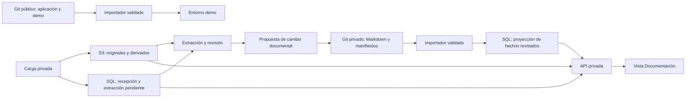

# Expedientes privados: arquitectura futura

Estado: propuesta opcional. La aplicación pública conserva un expediente de
demostración generalizado y toda su geometría reutilizable. Los identificadores,
la ubicación precisa y los documentos del caso original se mantienen fuera del
software público. Esta separación no implementa S3 ni un importador documental.

## Recomendación

Separar el repositorio público de la aplicación y el repositorio privado del
expediente. Usar Markdown estructurado como fuente de verdad del conocimiento
revisado, almacenamiento compatible con S3 para los documentos y una base SQL
para las consultas y el trabajo de incorporación de información.

La fuente de verdad se define **por tipo de información**. No habrá un dato
revisado editable independientemente en Markdown y en SQL. La DB será una copia
consultable de ese conocimiento, pero tendrá también información operativa propia.

| Información | Lugar autoritativo | Función de las demás copias |
| --- | --- | --- |
| Código, esquema, migraciones, importadores y documentación técnica | Git público de la aplicación | Imágenes y despliegues se construyen desde una revisión de código. |
| Investigación, conclusiones, medidas revisadas, citas y relaciones del inmueble | Markdown estructurado en Git privado del expediente | SQL permite consultar, filtrar y presentar una revisión importada. |
| PDFs, fotos, videos y binarios originales del expediente | Objetos privados en S3, con ID y hash estables | Git conserva manifiestos/referencias; SQL mantiene el catálogo operativo. |
| Capturas pequeñas de APIs y manifiestos de evidencia | Archivos versionados del expediente privado | Se indexan junto a sus citas; una captura grande puede residir en S3. Cada fuente declara dónde está su original. |
| Cargas recibidas, extracción pendiente, candidatos, tareas y errores | DB | Aún no son hechos revisados; archivos asociados en S3. |
| Usuarios, permisos, sesiones y auditoría de operación | DB | No se reconstruyen a partir de los Markdown. |
| Texto OCR, miniaturas y otros derivados | S3 para bytes; DB para estado/versiones | Regenerables solo si se conservan original, configuración y herramientas necesarias. |
| Búsqueda y tablas de hechos revisados | SQL como proyección | Reconstruibles desde Git privado y manifiestos validados. |
| Ejemplos ficticios y assets genéricos redistribuibles | Git público o paquete público de assets | Pueden sembrar un entorno demo; no incorporan el caso real. |

Que una dirección o ficha catastral venga de una API pública no convierte en
público nuestro expediente, sus relaciones con el interior ni la identidad del
propietario. El ejemplo de la aplicación abierta será generalizado. La instalación
que consulta el departamento real será privada.

## Repositorios y archivos

Estructura propuesta, todavía no creada:

```text
t3-designer/                         # Repo público de software
  apps/web/                         # Las tres vistas, sin datos reales embebidos
  apps/api/                         # Lectura y futura ingestión autorizada
  packages/dossier-schema/           # Contrato y validadores puros
  packages/dossier-import/           # Lector Markdown y reconciliación
  migrations/                       # Esquema de la base de datos
  docs/                             # Arquitectura, método y documentación técnica
  examples/demo/                    # Markdown y assets ficticios/licenciados

t3-dossier/                         # Repo Git privado, fuera del checkout público
  inmueble.md                       # Índice y referencias por ID
  entidades/*.md                    # Parcela, edificio, lote, departamento, estancia
  hechos/*.md                       # Afirmaciones revisadas y evidencia
  investigaciones/*.md              # Narrativa y cuestiones abiertas
  fuentes/*.md                      # Emisor, versión, acceso, citas y ubicación
  snapshots/                        # Capturas pequeñas con procedencia
  manifests/                        # Índice de objetos y revisiones de contenido
```

Los nombres de repositorio son propuestas. El ejemplo público puede convertirse
en una plantilla de contenido, pero no publica el expediente original.

Un checkout del repo privado proporciona los `.md` en el filesystem. En ejecución
puede montarse como solo lectura para el importador; no se copia dentro de la
imagen pública. El backend de lectura no necesita escribir en Git para mostrar
información. Las revisiones de contenido son independientes de las de software.

## Markdown como fuente de verdad útil

Los campos que alimentan la aplicación estarán en frontmatter YAML validado.
El cuerpo Markdown explica la interpretación, las diferencias y las decisiones.
No se extraerán cifras de tablas libres mediante heurísticas para poblar SQL.

Ejemplo **ficticio**, abreviado para explicar el formato:

```markdown
---
schemaVersion: 1
id: demo-area
entityId: demo-apartment
visibility: public
assertions:
  - id: demo-area-claim
    property: area.carrez
    value: 42
    unit: m2
    evidenceType: synthetic
    reviewStatus: example
    sourceId: demo-document
    locator:
      printedPage: "3"
---
# Superficie del ejemplo

Dato inventado para probar la aplicación. No describe un inmueble real.
```

Cada afirmación real necesita ámbito, definición, unidad, tipo de evidencia,
estado de revisión, fuente y localizador. La fuente añade emisor, fechas,
versión, privacidad y referencia al archivo/objeto original. Separar página real
del PDF y numeración impresa; en APIs, conservar campo/JSON Pointer; en videos,
ID y tiempo. Una relación entre entidades también requiere evidencia.

Las tablas de la web se generan desde esos campos. Cuando una tabla Markdown
repita valores, se generará o comprobará su consistencia; no habrá otro catálogo
JSON editable con las mismas cantidades. Una exportación JSON generada puede
existir como artefacto de una revisión, sin convertirse en otro origen editable.

Mantener alternativas y discrepancias: la misma superficie con otra definición,
fecha o ámbito no reemplaza automáticamente una afirmación. La precisión
numérica tampoco mejora la precisión de la fuente. Lo desconocido se conserva
como desconocido, y el modelo 3D sigue identificado como representación estimada.

## Flujo de datos y autoridad



Una corrección de un hecho consolidado modifica su Markdown y después se
reimporta. Si la interfaz permite editar más adelante, producirá una propuesta de
cambio contra la revisión de Git conocida; no escribirá directamente el mismo
valor en SQL. La primera versión puede usar importación por comando y edición de
archivos: evita implementar escritura automática en Git antes de necesitarla.

Una carga nueva crea un registro operativo privado y un objeto. La extracción
produce candidatos, no hechos confirmados. Revisarlos permite incorporarlos a
Markdown con sus citas. Guardar la relación entre la recepción, el candidato y la
afirmación incorporada; no perder la evidencia ni confundir pendiente con vigente.

## Sembrar DB y storage desde archivos

La idea de llenar la DB y storage desde el codebase funciona para el catálogo y
assets **que realmente están en ese origen**. Habrá entradas separadas:

- Demo: repo público, datos generalizados y recursos redistribuibles.
- Expediente real: repo privado y archivos originales privados que se incorporen.
- Cargas realizadas desde la aplicación: DB/S3, fuera del alcance de la semilla.

Contrato del importador:

1. Validar esquema, referencias, ámbito y acceso; mostrar un plan de cambios antes
   de aplicarlo. Distinguir versión de esquema, revisión Git y revisión importada.
2. Identificar cada registro por `originNamespace` e ID estable; conservar hash,
   revisión de origen y qué importador lo administra. No emparejar por nombre.
3. Importar dos veces la misma revisión produce el mismo estado. Un cambio solo
   actualiza registros administrados por ese origen, nunca cargas operativas.
4. Publicar la proyección SQL en una transacción después de validar el conjunto.
   Una revisión inválida deja la anterior activa e identifica el error.
5. Un registro ausente puede marcarse retirado dentro de su origen. No borrar
   automáticamente objetos, historial ni cargas porque falten en un manifiesto.
6. Un objeto nuevo recibe una referencia estable y hash de contenido. Nunca
   reemplazar silenciosamente los bytes de un documento al que ya apuntan citas.

SQL y S3 no comparten una transacción. La ingestión usará estados explícitos
(`pending`, `stored`, `indexed`, `failed`) y operaciones reintentables: comprobar
objeto y hash antes de marcar disponible; tolerar cortes entre ambos sistemas;
reconciliar objetos huérfanos con revisión, sin eliminaciones automáticas.

No ejecutar un reset de datos al arrancar o desplegar. Una semilla inicial y una
actualización controlada son operaciones distintas del inicio de la aplicación.
Comandos orientativos: `dossier:validate`, `dossier:plan`, `dossier:import` y
`demo:seed`; aún no existen.

## Qué se puede reconstruir y qué necesita conservarse

| Elemento perdido | ¿Se recupera desde Git? |
| --- | --- |
| Código y demo versionada | Sí, desde su revisión y dependencias. |
| Proyección SQL de hechos revisados | Sí, desde el repo documental y manifiestos; los objetos citados deben seguir disponibles. |
| Original subido únicamente a S3 | No. Un manifiesto con hash no contiene los bytes. |
| Carga/OCR pendiente, usuarios, permisos o auditoría | No necesariamente; requieren conservar la DB y objetos correspondientes. |
| Contenedor de aplicación | Debe poder reemplazarse manteniendo el contenido persistente. |

La estrategia de recuperación debe contemplar **Git privado, DB y objetos**, no
solo volver a ejecutar semillas. La versión de un objeto puede ayudar a recuperar
sobrescrituras; S3 la tiene desactivada por defecto y hay que configurarla
explícitamente. Validar su soporte al elegir un proveedor compatible.
[Documentación oficial de S3 Versioning](https://docs.aws.amazon.com/AmazonS3/latest/userguide/Versioning.html).

## Containers y elección de servicios

Propuesta mínima: una API, una base PostgreSQL, un proveedor S3 y un importador
que corre como comando/job. PostgreSQL es una recomendación de diseño, no una
instancia creada ni una exigencia de infraestructura existente. No hacen falta
por ahora microservicios adicionales, CMS, buscador vectorial ni cola separada.

PostgreSQL y el servidor de objetos pueden correr en containers. Lo que debe
persistir fuera de su capa descartable son sus datos, mediante volúmenes/discos o
servicios externos. Docker documenta que los volúmenes sobreviven a la eliminación
del container; un archivo en su capa escribible no lo hace. Persistencia no
significa necesariamente otro servidor. [Docker: almacenamiento](https://docs.docker.com/engine/storage/).

Definir un adaptador S3 por contrato, sin depender de funciones exclusivas de un
producto. **No elegir automáticamente MinIO Community:** al consultar su
[repositorio oficial](https://github.com/minio/minio) el 27/09/2026 aparece archivado
el 25/04/2026 y declara que ya no se mantiene. El proveedor se decidirá al evaluar
el despliegue, mantenimiento y funciones necesarias. Esto no cambia el reparto
de responsabilidades de esta propuesta.

## Acceso privado y publicación del software

La API verifica acceso al expediente antes de devolver metadatos o documentos.
Los buckets reales son privados. Los originales se sirven mediante la API o con
URLs firmadas de corta duración tras autorización; no se guardan URLs firmadas
como referencias duraderas. El manifiesto usa IDs, claves/versiones de objeto y
hashes; no credenciales ni rutas personales del disco.

La UI de un mismo software puede funcionar como demo pública con datos generalizados
y como instalación privada con el expediente real. Cambiar el dataset no habilita
su acceso público. Los derivados, extracciones y miniaturas heredan el acceso del
original. Ningún contenido privado entra en frontend estático, fixtures públicos,
imágenes de container, logs de CI públicos ni documentación del repo abierto.

## Frontera actual del ejemplo público

La geometría de la demo permanece reutilizable, con IDs locales, origen solar
regional aproximado y datos descritos como ilustrativos. Los originales del caso
real, evidencias operativas y registros de ubicación están fuera del repo público.
Conservar geometría distintiva no garantiza anonimato frente a comparación de
formas. Un expediente real futuro requiere autorización y control de acceso.

Los nuevos originales y derivados no deben entrar automáticamente en fuentes,
fixtures, snapshots, binarios, capturas ni builds públicos. La limpieza del árbol
actual no borra contenido del historial Git: revisar la historia por separado y
no reescribirla sin una decisión explícita y coordinada.

## Fases de implementación

1. **Contrato y clasificación:** consolidar este reparto, formato Markdown y
   manifiestos; inventariar lo que pasa al expediente privado. Mantener operativa
   la reconstrucción existente mientras se prepara el ejemplo generalizado.
2. **Separar aplicación y contenido:** repo privado/dataset, carga por API,
   exportación Blender desde una revisión explícita y demo pública generalizada.
   Elegir proveedor y persistencia cuando exista un destino de despliegue concreto.
3. **Primera vista documental:** Markdown privado → importador → proyección SQL →
   API → tercera pestaña. Lectura de documentos S3 y actualización sin reconstruir
   React. Mantener estado de las vistas 3D, carga diferida y lectura sin WebGL.
4. **Documentos de compra:** carga privada, extracción por página, revisión,
   candidatos y promoción a Markdown; conflictos y cambios de versión visibles.
5. **Operación y publicación:** comprobar separación, autorización, integridad y
   recuperación. Publicar solo software/demo; el expediente sigue privado.

Pruebas significativas al implementar: reimportación idempotente, revisión nueva
visible sin rebuild, ausencia de modificaciones a uploads al reconciliar,
recuperación tras un corte SQL/S3, referencias y versiones válidas, actualización
concurrente rechazada si parte de una revisión obsoleta, reconstrucción de la
proyección y acceso denegado a documentos ajenos. Verificar que repositorio
público, historial y build no contienen datos del caso privado.

Esta propuesta no implementa servicios, repositorios nuevos, importadores ni
migraciones. La tercera vista se desarrolla por separado con el alcance de la
[POC local](../research/property-dossier.md), sin depender de esos componentes futuros.
