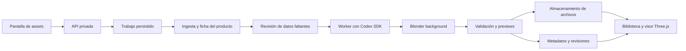

# Generación de assets 3D en servidor

Investigación del 3 de octubre de 2026 para la siguiente iteración de T3 Designer.

**Es viable crear los muebles en un servidor y usarlos después en el apartamento interactivo.** La propuesta es ejecutar Codex en un worker privado que dirija Blender mediante Python, generar un GLB y conservar una versión editable y sus referencias. El proyecto ya tiene un pipeline de Blender sin interfaz. La incertidumbre principal es la fidelidad que lograremos a partir de las fotografías de cada producto, no la posibilidad de ejecutar Blender remotamente.

Este documento conserva la investigación y la arquitectura propuesta. **Actualización de la misma iteración:** se implementó el [taller local](../workflows/local-asset-workshop.md), con pantalla de biblioteca, API, cola SQLite, Codex SDK usando la suscripción ChatGPT existente y Blender en background. La infraestructura remota y la reconstrucción automática fiel desde fotografías siguen pendientes. La búsqueda web del agente puede leer fichas y pedir datos faltantes; no equivale todavía a una ingesta visual completa de cualquier tienda.

## Primer producto elegido

El usuario eligió [IKEA STRANDMON Nordvalla gris oscuro, 203.432.24](https://www.ikea.com/es/es/p/strandmon-sillon-orejero-nordvalla-gris-oscuro-20343224/), buscando medidas correctas y parecido visual. Exterior: ancho 82 cm, fondo 96 cm y alto 101 cm, concordantes entre texto y dibujo. En el contrato web, ancho × alto × fondo será `[0.82, 1.01, 0.96]` m. Son cotas del fabricante, no mediciones nuestras ni medidas de embalaje.

**Existe una discrepancia de asiento:** el texto declara ancho 49 cm y altura 45 cm; [el dibujo de esa misma ficha](https://www.ikea.com/es/es/images/products/strandmon-sillon-orejero-nordvalla-gris-oscuro__0963366_pe808498_s5.jpg?f=u) indica 50 y 43 cm. Ambos dan fondo 54 cm. El borrador toma provisionalmente el texto y conserva ambas fuentes; esas cotas no deben marcarse como inequívocas.

La galería y el visor 3D público permiten observar brazos enrollados, orejas, botones del respaldo, cojín separado y patas oscuras. Se identificaron referencias [frontal en perspectiva](https://www.ikea.com/es/es/images/products/strandmon-sillon-orejero-nordvalla-gris-oscuro__0325432_pe517964_s5.jpg?f=xl), [posterior](https://www.ikea.com/es/es/images/products/strandmon-sillon-orejero-nordvalla-gris-oscuro__0836847_pe596292_s5.jpg?f=xl) y [detalle del brazo](https://www.ikea.com/es/es/images/products/strandmon-sillon-orejero-nordvalla-gris-oscuro__1494736_pe1004875_s5.jpg?f=u). El visor mostró el producto, pero no se obtuvo un archivo 3D oficial reutilizable.

Nuestra reconstrucción debe identificar como inferidas las curvas, inclinaciones, longitudes de patas, costuras y respuesta del material. La aprobación de parecido seguirá pendiente hasta comparar el borrador desde varias vistas. Guardar el SKU y la variante evita mezclar referencias de otros tapizados o versiones.

## Blender y Codex en el servidor

| Pregunta | Resultado |
| --- | --- |
| ¿Necesitamos la Mac o una ventana de Blender? | No. Blender admite scripts, modelado, exportación y render en background. El proceso necesita Blender instalado en el servidor, pero no una sesión gráfica para este pipeline. |
| ¿Podemos usar solamente una API Python? | Sí: `bpy` es la API Python de Blender y también existe como módulo instalable. Para este proyecto recomiendo el ejecutable de Blender con su Python incluido: reutiliza nuestros scripts y aísla cada trabajo en un proceso. |
| ¿Necesitamos GPU? | El modelado procedural y la exportación pueden empezar con CPU; también las miniaturas mediante Cycles CPU. Una GPU es una optimización posterior o una dependencia de un generador neuronal alojado por nosotros. |
| ¿Sirve el MCP actual en headless? | El add-on instalado, `mcp-for-blender 2.1.0`, protocolo 11, rechaza explícitamente `bpy.app.background`. Depende de timers de la interfaz y sus capturas buscan un viewport. |
| ¿Se puede mantener ese MCP en Linux? | Su código propone una interfaz gráfica con pantalla virtual, por ejemplo Xvfb. Es otra arquitectura, con más dependencias. El Docker del proyecto MCP por sí solo no instala un Blender headless operativo. |

Fuentes primarias: [Blender por línea de comandos](https://docs.blender.org/manual/en/4.5/advanced/command_line/index.html), [bpy como módulo](https://docs.blender.org/api/main/info_advanced_blender_as_bpy.html), [límites de threading](https://docs.blender.org/api/5.0/info_gotchas_threading.html) y [código del add-on MCP](https://raw.githubusercontent.com/ahujasid/mcp-for-blender/main/src/blender_mcp/bundled/addon.py). La dependencia de interfaz también se comprobó en el paquete instalado localmente; no se infiere únicamente del README.

El MCP es opcional: Codex puede invocar un comando de generación directamente. Si más adelante conviene exponerlo como herramienta, podemos crear un MCP pequeño con operaciones como generar, validar y renderizar que deleguen en el worker. Las imágenes para revisión salen de cámaras renderizadas; no necesitamos capturar una ventana.

La documentación oficial confirma varias interfaces de OpenAI:

| Interfaz | Qué aporta | Encaje propuesto |
| --- | --- | --- |
| Codex SDK | Integración programática en aplicaciones y trabajos en segundo plano; la librería TypeScript se ejecuta del lado del servidor y permite continuar sesiones. | Primera opción para un trabajo de creación por asset. |
| Codex app server | Protocolo para clientes que necesitan historial, autenticación, aprobaciones y eventos. La documentación marca el transporte WebSocket como experimental y no soportado para producción. | Evaluar si construimos una interacción de agente más profunda; mantenerlo detrás del backend. |
| Agents API con entorno propio | OpenAI opera el harness; nuestro contenedor ejecuta comandos y MCP mediante `codex exec-server`. | Alternativa administrada, a validar con el acceso de nuestra cuenta. No es lo mismo que alojar el harness completo. |

Fuentes: [Codex SDK](https://learn.chatgpt.com/docs/codex-sdk), [app server](https://learn.chatgpt.com/docs/app-server), [Agents API](https://developers.openai.com/api/docs/guides/agents-api/overview) y [entornos propios](https://developers.openai.com/api/docs/guides/agents-api/environments/self-hosted). No usar como base ejemplos antiguos de `codex mcp-server`: la documentación actual del SDK indica que ese comando fue retirado. El Agents SDK es otra opción para construir nuestro propio bucle de agente; no hace falta añadirlo encima del Codex SDK para este caso.

En la opción SDK, alojar Codex significa alojar el proceso que organiza el trabajo y sus herramientas; la inferencia sigue usando el servicio del modelo. Para la iteración local el usuario eligió expresamente reutilizar su sesión ChatGPT del CLI: el adaptador no necesita una API key y las llamadas usan los límites de su suscripción. La integración se comprobó con un análisis real del STRANDMON. La elección de identidad y facturación para un servicio remoto queda pendiente. [Autenticación oficial](https://learn.chatgpt.com/docs/auth).

## De una URL a un mueble

Propuesta de flujo:

1. **Recoger evidencia.** Descargar la página pública, extraer datos de producto, imágenes, medidas y variante seleccionada. Intentar primero HTML y datos estructurados; usar un navegador automatizado si la página necesita JavaScript. El SDK no convierte una URL automáticamente en una ficha completa. Schema.org contempla medidas, materiales, imágenes y variantes, pero cada tienda puede omitirlos. [Contrato Product](https://schema.org/Product).
2. **Preparar una ficha revisable.** Mostrar ancho, alto y fondo en metros, fotos de la misma variante, acabado y fuentes. Separar dimensiones del producto de las del embalaje. Marcar cada dato como declarado por la tienda, confirmado por el usuario o estimado. Si falta una medida esencial, preguntar antes de publicarlo como asset utilizable para comprobar encaje.
3. **Elegir el método.** Reutilizar un modelo autorizado del fabricante cuando exista; generar geometría paramétrica para muebles regulares; evaluar imagen a 3D para tapizados y formas más complejas.
4. **Generar y revisar.** Crear el modelo, renderizar vistas frontal, lateral y perspectiva, comparar con las referencias y corregir dentro de un número acotado de intentos. Registrar qué partes se infirieron porque las fotos no las muestran.
5. **Validar y guardar una revisión.** Exportar GLB, comprobar sus dimensiones reales, materiales y recursos, producir miniaturas y guardar `.blend`, ficha, referencias, versión del generador y hashes. La aprobación visual publica esa revisión en la biblioteca.

Una sola foto no determina de forma única la parte trasera, profundidad, costuras o estructura interna. Medidas correctas y parecido suficiente para decorar son un primer objetivo razonable. Una réplica comercial fiel necesita un ensayo con productos reales y más evidencia. El modelo no debe inventar dimensiones con apariencia de medición.

Como complemento, [Meshy](https://docs.meshy.ai/en/api/multi-image-to-3d) documenta generación desde 1–4 imágenes del mismo objeto, materiales PBR y salida GLB. [Tripo](https://platform.tripo3d.ai/docs/generation) documenta generación multivista con posiciones de cámara explícitas. [Hunyuan3D](https://github.com/Tencent-Hunyuan/Hunyuan3D-2) publica inferencia y servidor API para operar nuestra propia generación neuronal. Son candidatos, no una selección validada: no se han comparado resultados, precios por asset ni latencias. En todos los casos sigue haciendo falta normalización y control dimensional en Blender.

## Arquitectura propuesta



El backend y el worker pueden comenzar en un mismo servidor, como procesos separados. El trabajo pesado debe continuar aunque se cierre el navegador y no depender del tiempo máximo de una petición HTTP. Empezaría con una base de datos persistente y un solo worker; una tabla de jobs con reservas y reintentos evita necesitar Redis desde el primer día. Los procesos Blender tienen workspace propio, límite de ejecución y concurrencia limitada. La cola y el aislamiento de producción aún no existen en el repositorio.

Estados propuestos: `queued`, `extracting`, `needs_input`, `generating`, `validating`, `draft`, `ready`, `failed`, `cancelled`. La aplicación guarda el identificador del trabajo y de la sesión del agente, muestra eventos y permite continuar cuando el usuario completa información. Una clave de idempotencia evita duplicar trabajos; cada intento tiene outputs separados. Solo una revisión validada y aprobada se presenta como lista.

Usaría almacenamiento de objetos compatible con S3 para modelos, previews y referencias, y PostgreSQL para catálogo, jobs y revisiones. S3 y R2 soportan URLs temporales firmadas para acceso a objetos; el navegador no recibe credenciales del bucket. La selección de proveedor queda abierta. Guardar claves de objeto estables, no URLs firmadas caducables, en los registros. [S3](https://docs.aws.amazon.com/AmazonS3/latest/userguide/using-presigned-url.html), [R2](https://developers.cloudflare.com/r2/api/s3/presigned-urls/).

Cada revisión debería conservar `assetId`, `revisionId`, categoría, dimensiones y su procedencia, orientación, superficie de apoyo, slots de material, clave de cada archivo, hash, generador y estado de revisión. Las instancias del apartamento apuntan a una revisión concreta; mejorar un modelo no cambia silenciosamente habitaciones ya decoradas.

Para operar el servicio, la ingesta debe limitar destinos públicos y validar también redirecciones, evitando acceso a direcciones internas desde URLs recibidas. El texto de las tiendas es evidencia, no instrucciones para el agente. El código generado se ejecuta en un contenedor sin secretos de producción, acceso al host ni socket Docker, con recursos limitados. El backend controla publicación y permisos; una respuesta del agente por sí sola no los concede. Son condiciones del futuro servicio, no capacidades añadidas por el prototipo actual.

## Encaje con T3 Designer

La base actual ya incluye React, Three.js, carga de GLB, geometría métrica y una exportación reproducible a Blender. Las convenciones son metros, Y arriba y frente +Z en la web; Blender usa `(x, -z, y)`. [Arquitectura actual](../architecture/architecture.md) y [workflow de Blender](../workflows/blender.md).

Quedan cambios de contrato concretos: `AssetSchema` solo admite `/models/` y dimensiones estimadas; el snapshot requiere archivos del repositorio; `Fixtures` lee catálogo e instancias estáticas. Una biblioteca remota necesita un contrato versionado de assets y un resolvedor de archivos, además de estado persistido de decoración. Conviene conservar el catálogo de reconstrucción actual y añadir una capa de diseño del usuario, con IDs y revisiones explícitos.

La futura pantalla tendrá entrada de URL y notas, ficha de dimensiones editable con fuentes, preguntas pendientes, progreso, preview giratorio y revisiones. La publicación en la biblioteca será distinta de generar un borrador. Es una propuesta funcional; esta investigación no añade una pantalla con controles simulados.

Para «poné la televisión encima del mueble», el agente emitirá una operación estructurada sobre instancias, por ejemplo `place_on(tvInstanceId, standInstanceId, surfaceId)`. El motor resolverá la superficie, apoyará la base del objeto, comprobará encaje y colisiones y guardará una operación deshacible. Guardar esa relación permite mover ambos juntos. No hace falta regenerar geometría para trasladar objetos. Cambiar el color de un mantel puede cambiar un material; cambiar su caída o sus pliegues requiere otra geometría o simulación.

## Primer incremento y criterios de avance

La prueba inicial implementa fichas JSON y un comando de Blender background con salidas independientes. Incluye una mesa sintética y un borrador del STRANDMON construido durante esta investigación a partir de las referencias. Sirve para verificar el contrato de generación y preparar un worker; la selección de referencias y la escritura de la receta del sillón se hicieron en esta sesión, y todavía no constituyen un flujo autónomo URL → Codex SDK → modelo.

```sh
pnpm blender:generate --input scripts/blender/fixtures/table-job.json --output-dir artifacts/generated-assets/my-table-v1
```

Cada ejecución requiere un directorio nuevo. Produce `model.glb`, `source.blend`, `preview.png`, `request.json` y `manifest.json`. La ejecución verificada quedó en `artifacts/generated-assets/table-proof-v2/`: GLB de 71.484 bytes, 940 triángulos, 5 mallas y un material, sin cámaras, luces ni dependencias externas. Sus dimensiones exportadas son 1,20 × 0,75 × 0,70 m dentro de la tolerancia numérica. Se cargó también con `GLTFLoader` de Three.js y se comprobaron su caja y apoyo en Y=0. El manifest registra una superficie de apoyo del tablero a 0,75 m.

La generación con preview Cycles CPU de 384 × 384 y 16 muestras tardó aproximadamente 1,28 s en esta Mac; no es un benchmark de servidor ni de un sillón reconstruido. La comprobación del repositorio `pnpm check` pasó; la suite Python final tiene 28 tests. En el sandbox local, Blender fallaba en la inicialización Metal antes de ejecutar Python; el proceso aislado fuera de ese sandbox completó la prueba. No se modificó la sesión gráfica abierta.

El borrador del sillón se reproduce con:

```sh
pnpm blender:generate --input scripts/blender/fixtures/strandmon-job.json --output-dir artifacts/generated-assets/my-strandmon-v1 --resolution 640 --samples 32
```

Su receta produce también vistas frontal y lateral. Las formas del tapizado y el tejido son aproximaciones creadas para la prueba. Tener un GLB válido con volumen correcto no significa haber alcanzado una réplica fiel: esa evaluación visual sigue abierta. Las medidas, el conflicto de fuentes, las inferencias y el estado de borrador quedan en el manifest.

La muestra final está en `artifacts/generated-assets/strandmon-draft-v4/`. Su GLB pesa 961.664 bytes y contiene 46.448 triángulos, 20 mallas, 3 materiales y una textura embebida, sin recursos externos ni objetos de estudio. La envolvente medida es 0,82 × 1,01 × 0,96 m con origen en el suelo. Se comprobó en Chrome con el `GLTFLoader` de Three.js: carga completa, textura 256 × 256 presente y sin errores de loader. Se inspeccionaron los renders y la captura del navegador `browser-perspective.jpg`.

La generación de esos archivos y tres renders de 640 × 640 con 32 muestras tardó aproximadamente 5,94 s en esta Mac. Ese tiempo corresponde a ejecutar una receta ya escrita: excluye investigar la ficha, crear la receta e iterar visualmente. El cojín tiene un ancho exterior inferido de aproximadamente 62,3 cm, separado de la cota publicada de ancho útil del asiento. Su parte superior queda a 45 cm según la elección provisional del texto. Esta distinción evita convertir una interpretación visual en una medida del fabricante.

Para aceptar un asset real, propongo comprobar dimensiones dentro de una tolerancia acordada, origen apoyado en el suelo, orientación, GLB autocontenido y cargable, límite de complejidad, previews desde varias vistas y revisión visual contra las fotos. Registrar tiempos de ingesta, agente, modelado, render y carga web por separado, junto con consumo del modelo y costes de proveedores. Un tiempo de render de la muestra no predice el coste de reconstruir un sillón.

Los siguientes incrementos son: ejecutar esta misma prueba en Linux; convertir la extracción manual del STRANDMON en una ingesta reproducible con ficha revisable; evaluar generación asistida con Codex y, si hace falta, un proveedor de imagen a 3D; añadir almacenamiento y jobs persistentes; integrar la biblioteca y luego las operaciones de decoración. La mesa comprueba el mecanismo; el sillón elegido permite evaluar el parecido de formas blandas.

No se ha desplegado infraestructura remota ni contratado servicios. El binario local es Blender 5.2.2 LTS. Docker está instalado, pero su daemon no estaba disponible durante la investigación, por lo que una ejecución en macOS no debe presentarse como una validación de Linux.
